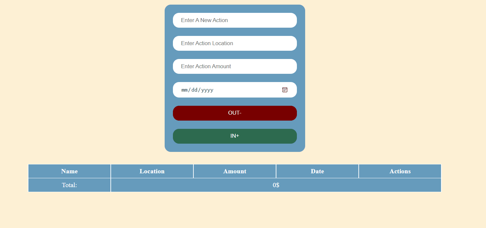

# CRUD Express Expenses Calculator Web App

This is an Expenses Calculator web application using mongodb as a database.

## 🔗 Links

## 🛠 Languages and Tools

- JavaScript
- HTML
- CSS
- Express
- Mongoose
- Fetch API

## Demo

## Future Updates

[ ] Authentication
